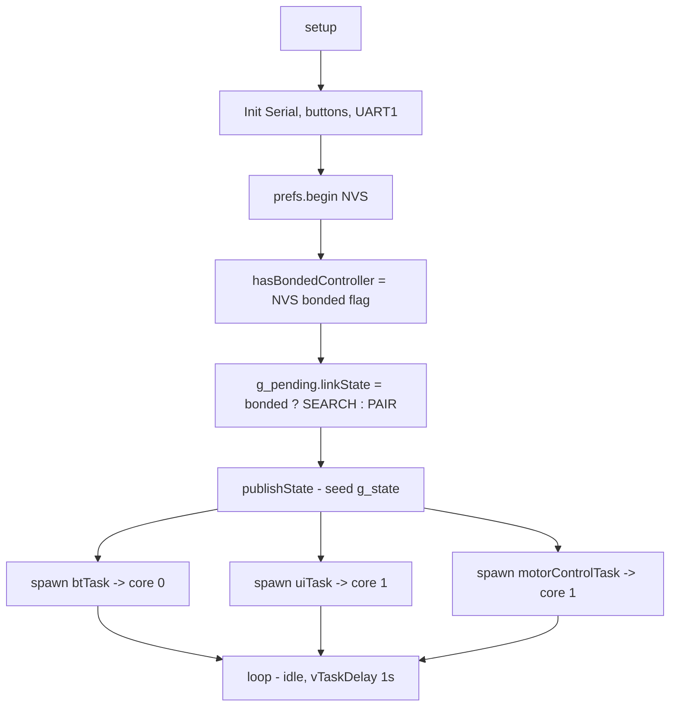
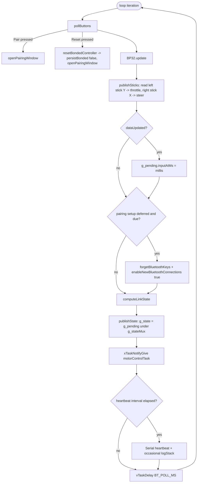
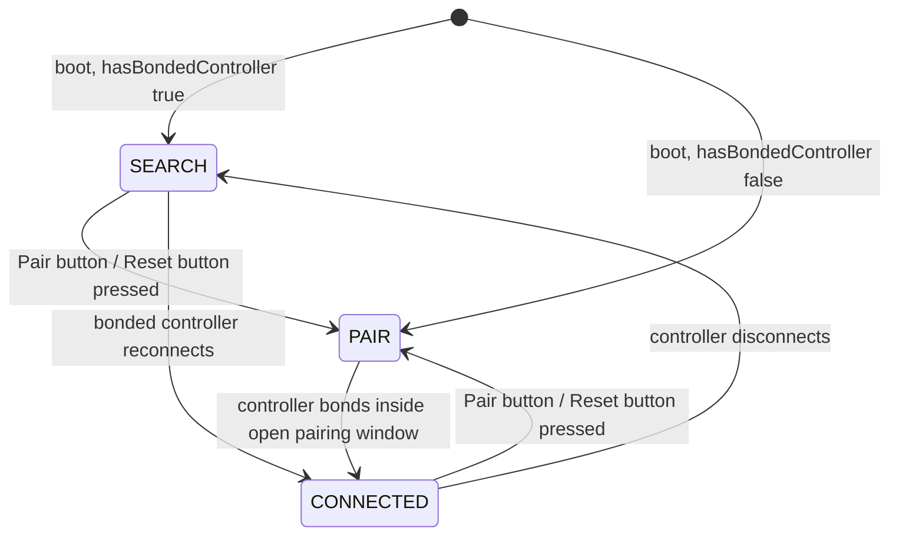
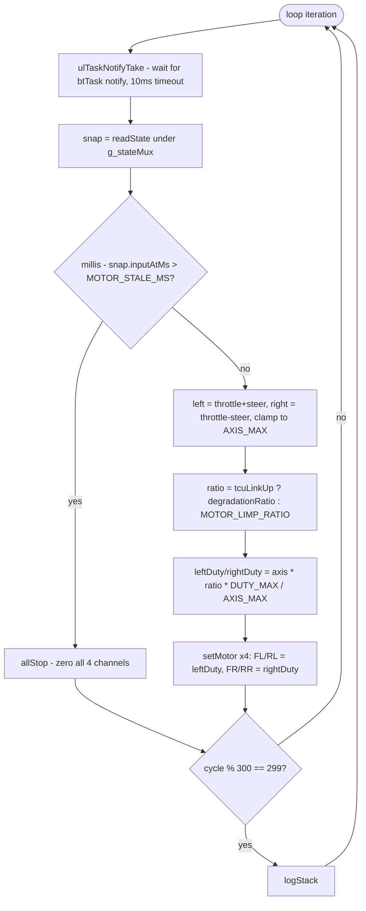
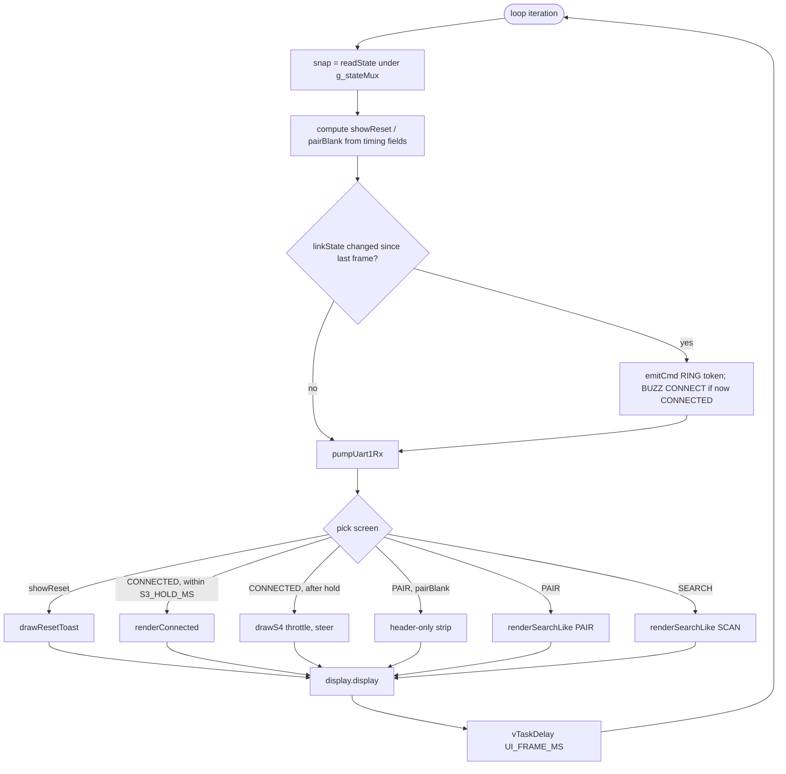
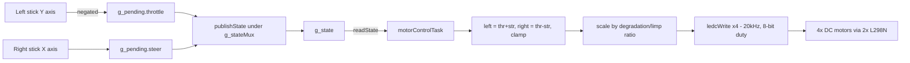

# Control Flow

## Boot sequence

## `btTask` loop (core 0, every `BT_POLL_MS` = 5 ms)

## `LinkState` state machine

`computeLinkState()` in `bt_task.cpp` re-evaluates this every iteration from
`anyControllerConnected()`, `pairingMode`, and `hasBondedController` — it's
not an explicit transition table, but the effective behavior matches the
diagram above.

## `motorControlTask` loop (core 1, priority 5)

## `uiTask` loop (core 1, priority 1, every `UI_FRAME_MS` ≈ 166 ms)

## End-to-end: gamepad stick → motor PWM

This is the path documented in `bt_task.cpp:publishSticks()` and
`motor_control.cpp:motorControlTask()` — see
[02_functionality.md](02_functionality.md) for the per-function detail
behind each box.
