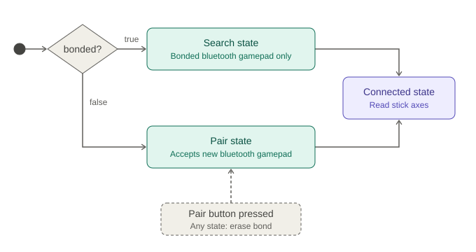

# NitroWorks ECU Firmware — Functionality Overview

## Platform / Build
- ESP32 (esp32dev) firmware built with PlatformIO + Arduino framework, using a custom Bluepad32-patched Arduino core for gamepad Bluetooth support.
- Uses `Adafruit SH110X`/`GFX` libraries to drive a 1.3" SH1106 OLED.
- Custom short build/core dirs (`D:/pio`) to avoid Windows command-line length limits.

## Dual-core task architecture (FreeRTOS on ESP32)
- **Core 0 — `btTask`**: owns Bluetooth pairing/gamepad input.
- **Core 1 — `uiTask`**: owns OLED rendering and UART1 TX/RX to the TCU.
- **Core 1 — `motorControlTask`**: owns 4-motor PWM output (woken by task notification from `btTask`).
- State is shared safely across cores via a mutex/spinlock-protected `RobotState` struct (`publishState()` / `readState()`), copied once per loop iteration to minimize critical-section time.

## Bluetooth gamepad pairing (`bt_task.cpp`)
- Uses Bluepad32 to pair/bond with a single gamepad controller, persisting the bonded flag in NVS flash.
- State machine: **Search** (reconnect known bonded pad) → **Pair** (accept a new pad, wipes old bond) → **Connected**.
- Physical Pair button (debounced) trigger re-pairing or clearing the stored bond.
- Rejects unexpected/unbonded controller connections unless the pairing window is open.
- Extracts throttle (left stick Y) and steer (right stick X) axes from the connected gamepad each poll cycle.

## Motor control (`motor_control.cpp`)
- Skid-steer drive across 4 motors (FL/FR/RL/RR) via 2x L298N drivers, using PWM (`ledc`) for speed and digital pins for direction.
- Combines throttle + steer into left/right wheel duty cycles.
- Applies a "degradation ratio" (from the TCU link, stubbed for now) or a fixed limp-mode ratio if the TCU link is down, to cap speed.
- Auto-stops all motors if no new gamepad input has arrived within a stale-input timeout (safety cutoff).

## OLED UI (`oled_ui.cpp`)
- Renders different screens depending on link state: Scan/Search, Pair (with press-feedback blank frame), Connected (brief "READY" screen), then a live stick-check HUD (throttle/steer bar with ACC/REV/TURN labels).
- Emits `RING`/`BUZZ` commands over UART1 whenever link state changes (e.g., connect chime).

## UART link to TCU (`uart_link.cpp`)
- Sends command strings (`RING`, `BUZZ`) to the TCU over UART1 and logs any received TCU lines to serial. TCU(Telematics Control Unit) degradation-ratio/heartbeat parsing is stubbed (TODO) — currently defaults assume full performance and link-up.

## Config (`config.h`)
- Centralizes all GPIO pin assignments (buttons, I2C, UART1, motor driver pins) and tunable timing/threshold constants (deadzones, PWM frequency/resolution, stale-input timeout, UI frame rate, NVS keys, etc).

## Summary
It's a dual-core ESP32 robot/RC-car controller — pairs with a Bluetooth gamepad, drives 4 skid-steer motors from the stick input, shows pairing/driving status on an OLED, and relays ring/buzz commands plus (eventually) speed-limiting telemetry over UART to a separate TCU board.
